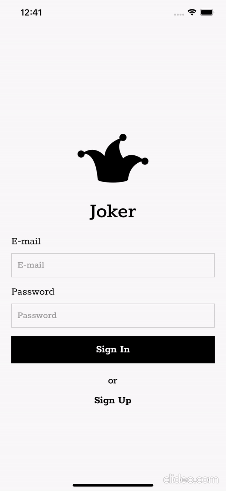
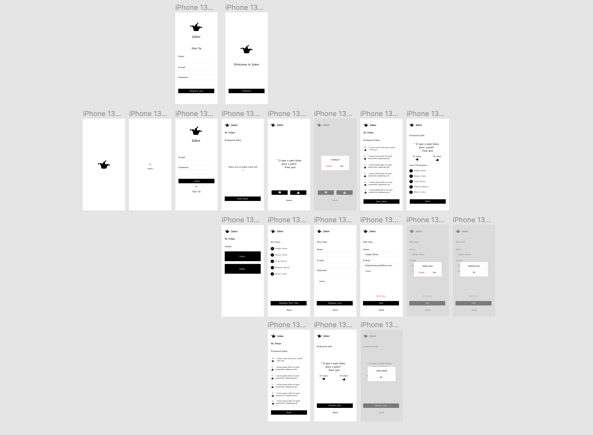

<p align="center">
  <div align="center">
    
  </div>
  <h2 align="center">Joker - A joke game app </h2>

  <p align="center">
    <br />
    <small>A simple app for testing Joke API</small>
    <br />

  </p>
</p>

## Contents

- [Contents](#contents)
- [About The Project](#about-the-project)
  - [Built With](#built-with)
- [See Figma Designer](#see-figma-designer)
- [Getting Started](#getting-started)
  - [Installation](#installation)
- [Contributing](#contributing)
- [Contact](#contact)

## About The Project

<div align="center">
  
</div>

<br />

### Built With

-   [ReactNative](https://reactnative.dev/)
-   [Expo](https://expo.dev/)
-   [Node](https://nodejs.org/en/)
-   [Express ](https://expressjs.com/pt-br/)
-   [Sequelize ](https://sequelize.org/)
-   [Sqlite3 ](https://www.sqlite.org/index.html)

## See Figma Designer

-   [Figma Designer ](https://www.figma.com/file/jzB44faUuatnyGU4kR9WcX/Joker?node-id=0%3A1)


 <div align="center">
    
  </div>


## Getting Started

To get a local copy up and running follow these simple steps.

### Installation

1. Clone the repo

```sh
git clone https://github.com/felipealvescosta/joker.git
```

2. Install packages

```sh
yarn install
```

3. Run Project

Run Server

```sh
yarn dev
```

Run Mobile App

```sh
expo start
```


4. To login 

Admin Level

```sh
E-mai: admin@admin.com
Password: admin
```


## Contributing

Contributions are what make the open source community such an amazing place to be learn, inspire, and create. Any contributions you make are **greatly appreciated**.

1. Fork the Project
2. Create your Feature Branch (`git checkout -b feature/YourFeature`)
3. Commit your Changes (`git commit -m 'Add some YourFeature'`)
4. Push to the Branch (`git push origin feature/YourFeature`)
5. Open a Pull Request

## Contact

[Felipe Alves](https://felipealvescosta.com) - [LinkedIn](https://www.linkedin.com/in/felipealvesdacosta/) - [GitHub](https://github.com/felipealvescosta)
